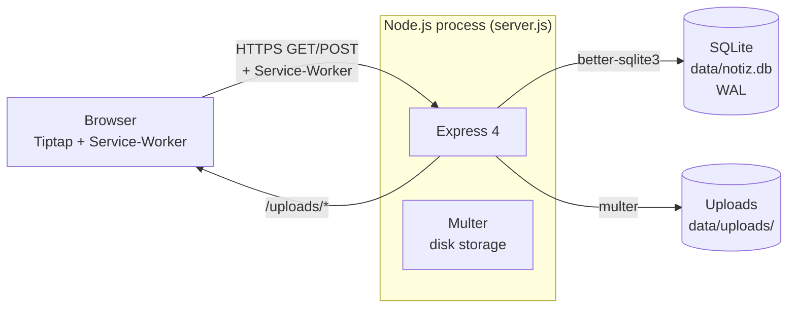
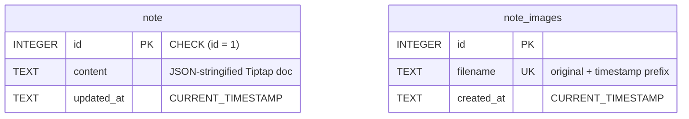
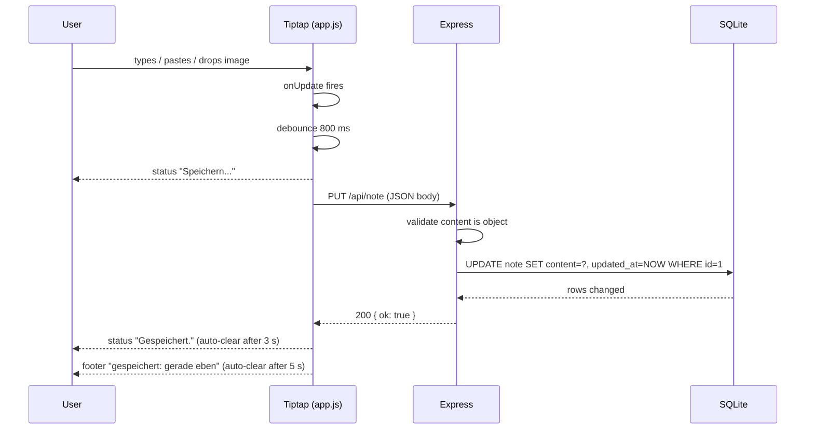
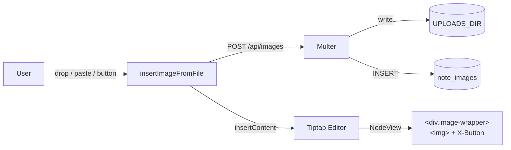

# ARCHITECTURE.md — System Reference

Technical deep dive: system layout, data model, API contract, deployment
topologies, operations runbook. For conventions and anti-patterns see
[`AGENTS.md`](../AGENTS.md).

## 1. System overview

A single Node.js process serves both the static SPA and a tiny REST API.
SQLite lives on the local filesystem; uploaded images live in a sibling
directory and are referenced by URL in the saved note.



Key consequences:

- **No external services.** No reverse-proxy-required database, no object
  storage. The whole app is one container.
- **Static + API on the same origin.** No CORS configuration needed. The
  service worker only needs the same origin.
- **WAL mode** lets SQLite readers proceed during a write.

## 2. Singleton-notiz pattern

The whole product is "one shared note". The database enforces this via a
check constraint, not application logic:

```sql
CREATE TABLE note (
  id          INTEGER PRIMARY KEY CHECK (id = 1),
  content     TEXT NOT NULL DEFAULT '{}',
  updated_at  TEXT DEFAULT CURRENT_TIMESTAMP
);
```



**Why a constraint, not a service layer?** Three reasons:

1. Database is the only authority. No code path can create a second note
   even by accident.
2. Migration stays trivial (`INSERT OR IGNORE`).
3. Tests can safely `UPDATE note SET content = ... WHERE id = 1` without
   racing for an `INSERT` slot.

**Trade-offs accepted:**

- Multi-tenant not possible without schema change. If the product needs
  per-user notes, switch to `(user_id, note_id)` composite PK and rework
  the API contract before adding features.
- Every client sees every keystroke (modulo network latency). No conflict
  resolution; last-write-wins on `PUT /api/note`.
- A long-running PUT could collide with another. Mitigation: 800 ms
  debounce on the client, and the server processes requests sequentially
  per Express handler (single-threaded Node).

## 3. Database schema

Two tables, both created idempotently on server start AND in
`scripts/init-db.js`. The two schemas must stay in sync — see the
"Schema changes" section in the runbook.

| Table         | Column      | Type      | Notes                                    |
| ------------- | ----------- | --------- | ---------------------------------------- |
| `note`        | `id`        | INTEGER PK | `CHECK (id = 1)` enforces singleton       |
|               | `content`   | TEXT NOT NULL DEFAULT '{}' | JSON-stringified Tiptap document |
|               | `updated_at`| TEXT DEFAULT CURRENT_TIMESTAMP | set on every `UPDATE`         |
| `note_images` | `id`        | INTEGER PK AUTOINCREMENT    |                                  |
|               | `filename`  | TEXT NOT NULL UNIQUE        | `<unix-ms>-<safe-original>`     |
|               | `created_at`| TEXT DEFAULT CURRENT_TIMESTAMP |                              |

**Content encoding:** `note.content` stores a Tiptap JSON document
(`{ type: "doc", content: [...] }`). The server does not inspect the
structure — it treats it as opaque JSON.

**Image filenames:** Multer's `filename` callback rewrites the original
to `<timestamp>-<safe>`, where `<safe>` replaces every character outside
`[a-zA-Z0-9._-]` with `_`. The timestamp prefix prevents collisions and
gives stable ordering.

## 4. REST API

Base URL: same origin as the app. All endpoints accept and return JSON
unless noted. Errors return `{ "error": "<message>" }` with an
appropriate HTTP status.

### `GET /api/note`

Returns the current note content.

**Response 200:**

```json
{ "content": { "type": "doc", "content": [...] } }
```

The `content` field is the parsed JSON document, not the stored string.

### `PUT /api/note`

Replaces the note content.

**Request body:**

```json
{ "content": { "type": "doc", "content": [...] } }
```

**Validation:** `content` must be present and be an object.

| Status | Meaning                                     |
| ------ | ------------------------------------------- |
| 200    | OK, body is `{ "ok": true }`                |
| 400    | `content` missing or not an object          |

Body limit: 1 MB JSON.

### `POST /api/images`

Multipart upload of a single image. Field name: `image`.

| Status | Meaning                                              |
| ------ | ---------------------------------------------------- |
| 200    | OK, body is `{ "url": "/uploads/<filename>" }`      |
| 400    | No file or non-image mimetype                        |
| 413    | File exceeds 10 MB                                   |

**Storage:** file written to `UPLOADS_DIR`, row inserted into
`note_images`. Filename is `<unix-ms>-<safe-original>`.

### `DELETE /api/images/:filename`

Removes the row from `note_images` and deletes the file.

**Security:** the resolved path must lie inside `UPLOADS_DIR` —
prevents path traversal (`../../../etc/passwd`). Both checks happen
before deletion.

| Status | Meaning                              |
| ------ | ------------------------------------ |
| 200    | OK, body is `{ "ok": true }`         |
| 400    | Filename resolves outside uploads    |
| 404    | No DB row for that filename          |

**Failure mode:** if the file is already gone on disk (e.g. manually
removed), the DB row is still deleted; the `unlink` error is swallowed.

## 5. Write flow



The 800 ms debounce coalesces a burst of keystrokes into one PUT.
On error, status flips to red (`Speichern fehlgeschlagen.`) and the
debounce does NOT retry — the user must trigger another edit.

## 6. Frontend module map

`public/app.js` runs as an ES module. The structure is intentionally flat:

```
┌─ DOM refs (#editor, #save-status, #btn-clear, #toolbar, #image-input)
├─ confirmDialog(message)            ← native <dialog> wrapper
├─ loadNote / saveNote               ← REST helpers
├─ uploadImage / deleteImageFile     ← image REST helpers
├─ openImageOverlay(src)             ← fullscreen overlay on image click
├─ insertImageFromFile(file)         ← orchestrates upload + editor insert
├─ createImageNodeView(props, ed)    ← Tiptap NodeView for 
├─ scheduleAutoSave                  ← 800 ms debounce → saveNote
├─ SLASH_COMMANDS                    ← static list of /menu entries
├─ matchCommand(cmd, query)          ← title + kw-array filter
├─ buildSlashItem / renderSlashMenu / positionSlashMenu
├─ SlashMenu                         ← Tiptap Extension wrapping Suggestion
└─ editor = new Editor({...})        ← single Tiptap instance
```

`editor` is a module-private `const`. The slash menu, toolbar, image
NodeView, and confirm dialog all reach it via closure — never via
`window`.

## 7. Image pipeline



- **Why NodeView, not post-insert wrapping?** External DOM mutation
  (`insertBefore` + `appendChild` on an image after `insertContent`)
  causes ProseMirror to re-render, which calls `onUpdate` again, which
  calls the wrapper function again — an infinite loop. The NodeView is
  the sanctioned pattern: PM owns the wrapper DOM and never reconciles
  it away.
- **Why a wrapper at all?** Three things the bare `` can't do:
  (1) the delete X button needs a positioned ancestor;
  (2) the click-to-overlay needs a non-`` element to attach the
  click handler to without breaking PM's selection model;
  (3) the wrapper's `:hover` (desktop) and `opacity:1` (mobile via
  `@media (hover:none)`) gate the delete button.
- **Delete from the NodeView** uses `props.getPos()` to find the
  current document position — the captured `node` reference is stale
  after the first transaction.

## 8. Service worker + share target

`public/service-worker.js` does two things:

1. **App-shell cache** on `install` — caches `/`, `index.html`,
   `style.css`, `app.js`, `manifest.json`, icons. The cache name is
   versioned (`notiz-benduhn-static-v<N>`); bumping the version on
   release invalidates the old cache.
2. **Share-target handler** for `POST /share-target`. The handler
   uploads any `image/*` files to `/api/images`, then `postMessage`s
   `{type:"share-target", payload:{title,text,url,hasImages}}` to a
   matching window client. If none exists, it `openWindow("/")`.

Note: there is **no Express route for `/share-target`**. The service
worker responds directly, so Express never sees the POST. Anything not
intercepted falls through to Express's 404.

## 9. Deployment topologies

### Local dev

Single process on the host. SQLite + uploads live under `data/`. Default
port `3000`.

### Docker (the supported topology)

- Container image: `Dockerfile` (Node 20 Bookworm-Slim, `node` user,
  `/data` writable).
- Compose: `compose.yaml` exposes `:8085`, mounts the named volume
  `notiz_data:/data`, sets `DB_PATH=/data/database.db`,
  `PORT=8085`, includes a healthcheck hitting `/api/note`.
- Behind a reverse proxy (Traefik, Caddy, Nginx): terminate TLS at the
  proxy, forward plain HTTP to `:8085`. The PWA's share-target and
  service-worker require HTTPS in production.

### Behind basic auth

This app has no built-in auth. For a public deploy, gate it with
`auth_basic` (Nginx), `basicauth` (Caddy), or `traefik.http.middlewares.
auth.basicauth.users` (Traefik). The service worker requires HTTPS, so
the reverse proxy must terminate TLS.

## 10. Backup strategy

The DB is a single SQLite file in WAL mode. To get a consistent snapshot:

```bash
# 1. Force a checkpoint (write pending WAL into the main file)
sqlite3 /data/database.db 'PRAGMA wal_checkpoint(TRUNCATE);'

# 2. Snapshot the file
cp /data/database.db /backup/notiz-$(date +%F).db
```

Include the `uploads/` directory in the same backup — the DB rows
reference filenames in there; an orphaned image is harmless but a missing
image with a live reference looks broken in the UI.

Suggested cron entry (daily 03:00, retain 14 days):

```cron
0 3 * * * /usr/local/bin/backup-notiz.sh
```

`backup-notiz.sh`:

```bash
#!/usr/bin/env bash
set -euo pipefail
SRC=/data
DST=/backup/notiz/$(date +%F-%H%M)
mkdir -p "$DST"
sqlite3 "$SRC/database.db" 'PRAGMA wal_checkpoint(TRUNCATE);'
cp "$SRC/database.db" "$DST/"
cp -r "$SRC/uploads" "$DST/"
find /backup/notiz -mindepth 1 -maxdepth 1 -mtime +14 -exec rm -rf {} +
```

## 11. Operations runbook

### Health check

`GET /api/note` must return 200 with valid JSON. Anything else means the
service is broken at the API level. The Docker healthcheck does exactly
this. For deeper checks, also verify:

- Disk space on the volume (SQLite + uploads live there).
- That `node` user can write to `/data` (chown if needed).

### Logs

The server logs only the listen line on startup. There is no request log
(morgan is in `dependencies` but not wired up). If you need access logs,
add `app.use(morgan('tiny'))` near the top of `server.js`.

### Schema changes

Both `server.js` (auto-init at startup) and `scripts/init-db.js`
(CLI migration) carry the same `CREATE TABLE IF NOT EXISTS` statements.
When changing the schema:

1. Edit both files.
2. Add a migration step (not just `CREATE TABLE IF NOT EXISTS`) — for
   column changes, use `ALTER TABLE`.
3. Run `npm run migrate` locally and verify the server boots.
4. For production: write a one-off migration script under `scripts/`
   and run it before deploying the new code.

### Common failure modes

| Symptom                                    | Likely cause                          |
| ------------------------------------------ | ------------------------------------- |
| 500 on PUT, "SQLITE_BUSY"                  | Another process holds the WAL file    |
| `getaddrinfo ENOTFOUND` on container start | Wrong `DB_PATH` volume mount          |
| Service worker never activates             | Site served over plain HTTP in prod   |
| Image upload returns 413                   | File > 10 MB (Multer limit)           |
| Note persists, images vanish after restart | `UPLOADS_DIR` not on the persistent volume |

### Port collisions

Port `3000` is the default; the Playwright config uses `:3737` to avoid
clashes on developer machines where another service may occupy `:3000`.
Override with `PORT` for both the server and the test config.

## 12. Extending the system

Adding a feature should follow the boundaries in `AGENTS.md`. Common
extensions and where they hook in:

| Feature               | Touch                                              |
| --------------------- | -------------------------------------------------- |
| Multiple notes        | `note` table PK + API surface — discuss first      |
| User accounts         | New `users` table, JWT/session middleware before `app.use('/api', ...)` |
| WebSocket sync        | Replace PUT polling with `ws` — see AGENTS §3     |
| Markdown export       | Add a server-side serializer that walks Tiptap JSON |
| Full-text search      | SQLite FTS5 virtual table mirroring `note.content` |
| Image variants/thumbs | Add an image-processing step in the Multer callback |